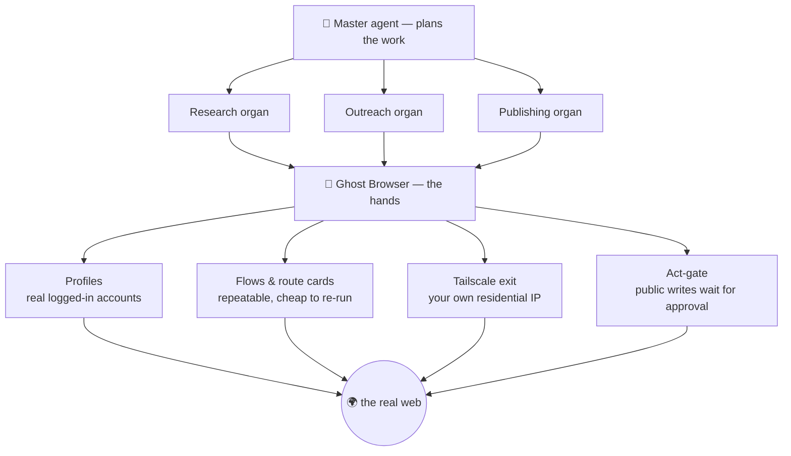

# Ghost Browser

**Give an AI agent real hands on the web.** A logged-in Chromium it drives like a person — seeing the page as numbered boxes, acting by number — behind a simple HTTP API, with an approval gate before anything public happens.

[](https://github.com/Wvdstoep/ghost-browser/actions/workflows/ci.yml)
[](LICENSE)
[](CONTRIBUTING.md)
[](https://github.com/sponsors/Wvdstoep)


> *What the agent actually sees — every interactive element on the live page numbered. It doesn't guess CSS selectors; it says "click 12".*

> ⚠️ **Early and honest:** the engine is solid and battle-tested in production, but the **console UI/UX is rough** — it was built by an engineer, not a designer. If design is your thing, this is a project where your help lands immediately and visibly. See [Help wanted](#help-wanted).

---

## Why this exists

An LLM can *decide* to reply to a lead, check a mailbox, or post an update. It cannot *do* it — it has no hands. Screen-scrapers and selector scripts break the moment a site is redesigned, and they can't hold a real logged-in session.

Ghost Browser is the missing hands. You log into a site **once, by hand**, and from then on an agent operates that real, logged-in session — robustly, because it perceives the page the way a person does, and safely, because anything the outside world would notice waits for your approval.

---

## What you can actually do with it

- **Log in once, automate forever.** Sign into LinkedIn / Gmail / a marketplace by hand in the console; the session persists in a **profile**, and the agent uses it from then on. No re-typing passwords, no storing credentials in scripts.
- **Let an agent operate the site by sight.** It gets a screenshot with every element numbered (Set-of-Mark) and acts by number — resilient to redesigns that shatter selector-based bots.
- **Keep a human in the loop where it matters.** Reading is free; posting, messaging, following, joining go through an **act-gate** that shows you the exact text and waits. Approve, edit, or reject.
- **Talk to it, don’t just script it.** A built-in **conversational agent** (in the desktop & mobile apps) runs on your own
  model and can both chat and *act* — it calls the whole GB API to browse, and to build & run automations or drive your other devices.
- **Run repeatable jobs without an LLM in the loop.** Compose **workflows** — typed steps (fetch, extract, script, branch, verify, check-login…) that run deterministically and return data.
- **Teach it a site's API by watching it.** **Route cards** record a platform's own network traffic once, distil it, and replay it — so the second run is fast and costs no model calls.
- **Run many accounts, each isolated.** One **profile** per account, isolated cookies and storage, each labelled with the site it's signed into.
- **Leave through your own home connection.** A built-in **Tailscale exit** routes a profile's traffic out through a device you own, so sites see a residential address instead of a datacentre. ([setup →](SETUP.md#4-the-part-that-makes-it-different-leave-through-your-home-connection))
- **Pass sites behind Cloudflare.** Turnstile verifies against Cloudflare challenge hosts that are **IPv6-only**; a proxied browser can’t resolve them, so the “verify you are human” checkbox renders but never completes. Ghost Browser resolves those hosts locally and reaches them through your residential exit, so challenge-gated sites actually load and verify instead of hanging.

---

## What it powers: an autonomous operator

Ghost Browser isn't a demo — it's the tool that makes a fully autonomous setup possible.

On the platform it was built for, a **master agent** plans work and delegates to specialised **organs** (research, outreach, publishing, and more). Every time one of them needs to *touch the real web as a real account* — read the company mailbox, post an update, apply somewhere, check a reply — it calls **Ghost Browser**. Without it, the whole thing is a planner with no way to act: an LLM that knows what to do and physically can't.



The same three things that make that safe for an autonomous agent make it useful for *anything* you point it at: it sees like a person, it holds real sessions, and it never does something public behind your back.

---

## Quick start

```bash
git clone https://github.com/Wvdstoep/ghost-browser.git
cd ghost-browser
docker build -t ghost-browser .
docker run -d -p 3000:3000 -e API_KEYS="a-long-secret:team" -v ghost-profiles:/profiles ghost-browser
```

Open `http://localhost:3000` for the console. Full guide, including the home-IP exit: **[SETUP.md](SETUP.md)**.

### Drive it by API

```bash
KEY="a-long-secret"
# open a session
SID=$(curl -s -X POST localhost:3000/v1/sessions -H "Authorization: Bearer $KEY" | jq -r .sessionId)
# go somewhere
curl -s -X POST localhost:3000/v1/sessions/$SID/navigate -H "Authorization: Bearer $KEY" \
  -H 'content-type: application/json' -d '{"url":"https://news.ycombinator.com"}'
# see the page as numbered elements (+ a screenshot)
curl -s localhost:3000/v1/sessions/$SID/analyze -H "Authorization: Bearer $KEY"
# click element 3
curl -s -X POST localhost:3000/v1/sessions/$SID/click -H "Authorization: Bearer $KEY" \
  -H 'content-type: application/json' -d '{"index":3}'
```

### Or give the agent a goal

Point it at a model (Ollama Cloud key, or a self-hosted endpoint), give it a goal, and watch it work through the same numbered view a person sees. When it wants to post or message, it stops and shows you the draft first.

---

## How it sees: Set-of-Mark

Before any decision, every interactive element on screen gets a numbered box painted over it *in the live DOM*, the page is screenshotted, the boxes are stripped off again, and the agent gets the annotated picture plus a numbered list. It then says `click 3`.

That's why it survives redesigns where selectors don't: a numbered screenshot is redrawn from whatever is on screen right now, and a language model is far better at looking at a picture than at parsing a DOM tree. (`src/inspector.js` is the marking code.)

---

## Under the hood

<details>
<summary><b>Sessions, limits, and why one browser per container</b></summary>

A browser session is not a request — it's a live process holding memory for its whole life. One Chromium per container with a **context** per session (isolated cookies/storage, shared process) is the difference between ~2 sessions per box and ~10.

| Limit | Default | Env |
|---|---|---|
| Sessions per container | 8 | `MAX_CONTEXTS` |
| Idle before close | 5 min | `IDLE_MS` |
| Absolute session TTL | 2 h | `SESSION_TTL_MS` |
| Drain at memory | 80% | `MEMORY_LIMIT_PCT` |

Memory is read from the **cgroup**, not the host, so a 4 GB container on a 64 GB node knows its real ceiling. At the limit it stops accepting sessions, finishes what it has, and exits to be replaced — on our terms, not the OOM killer's.
</details>

<details>
<summary><b>The SSRF guard</b></summary>

`src/guard.js` is the most important file here. A browser anyone can point at any URL is a server-side request forgery engine, and it may run *inside* the cluster it would attack. It closes two bypasses: a public hostname that **resolves** to a private address (every resolved address is checked), and a public URL that **redirects** to one (the landing URL is re-checked and the page blanked if it moved somewhere it shouldn't).
</details>

<details>
<summary><b>Looking like a person, not a bot</b></summary>

Deliberate pacing (1–3 s between reads, 7–16 s after a write — real people don't open eleven posts in four seconds). A profile can present as Windows or macOS via CDP's `Emulation.setUserAgentOverride` (which sets `navigator.userAgent`, `userAgentData` and the `Sec-CH-UA-Platform` header together, so the browser never contradicts itself). It does **not** claim to be undetectable — canvas, fonts, WebGL and TLS still describe what it is; it removes specific, avoidable tells.
</details>

<details>
<summary><b>Full API surface</b></summary>

```
POST   /v1/sessions                      → { sessionId, expiresAt, plan }
POST   /v1/sessions/:id/navigate         { url }
GET    /v1/sessions/:id/analyze          → { elements, summary, screenshot }
POST   /v1/sessions/:id/click            { index } | { text }
POST   /v1/sessions/:id/type             { index, text, submit }
GET    /v1/sessions/:id/content          → cleaned page text
GET    /v1/sessions/:id/screenshot       → image/jpeg
DELETE /v1/sessions/:id
GET    /v1/workflows                     → saved flows, enriched with outcomes
POST   /v1/workflows                     { name, nodes, edges }
POST   /v1/workflows/:id/run             → run a flow
GET    /v1/capacity                      → what this worker can still take
GET    /v1/config                        → what is configured, never a secret
```
Auth is `Authorization: Bearer <key>`; keys come from `API_KEYS` (`key:plan,key:plan`). No key, no browser — a session costs real memory, so an anonymous one spends someone else's money.
</details>

---

## Run it anywhere — cluster, laptop, or phone

Ghost Browser is the same engine wherever it runs; what changes is **where the browser physically lives** — which decides the
IP, the hardware fingerprint, and which walls it can walk through.

| Surface | What it is | Best for | Status |
|---|---|---|---|
| **Cluster** (server) | GB on your server — its own browser pool + the automations engine, behind the HTTP API | always-on jobs, scheduled flows, the API | live |
| **Desktop node** ([`mobile/desktop/`](mobile/desktop/)) | GB as a Windows app (Compose + **JCEF** Chromium) — one codebase with the phone, real desktop Chromium on your laptop’s home IP | desktop-only portals + Cloudflare, hands-on use, heavy web apps (CapCut) | live · installer below |
| **Phone node** ([`mobile/`](mobile/)) | GB as an Android app — real mobile Chromium on your residential IP | a real mobile identity, beating bot-detection a server can’t | live · APK below |

**One cluster, many nodes.** A laptop or phone **dials out** to the cluster’s device hub and registers as a drivable node (Android/
tailnet can’t accept inbound, so it always connects out). It then appears in `/v1/device/list`, and the backend drives it with the
same `/v1/*` commands — `navigate`, `analyze`, `click`, `type`, `fetch`, `eval` — so you choose *which real device* runs a task:
the phone for a mobile identity, the laptop for a desktop one, the cluster for always-on. Nothing upstream changes — a device is
“just another GB”.

**Talk to it — the built-in agent.** Both apps ship a full-screen **conversational agent**: instead of only handing it a goal, you
chat with it. It runs on **your own model** (a local Ollama endpoint, or any OpenAI-compatible API) and can both *talk* and *act*,
calling the whole GB API through a model-agnostic **JSON tool protocol** — browse a page, and **list / create / run automations**,
inspect your profiles and platforms, and even **drive your other device nodes**. Chat history is kept; model settings sit behind a gear.

**See every node — the Device Hub.** The **same** `/hub` page is reachable from all three surfaces —
the cluster console (a *Device Hub* item in the nav), the desktop app (a *Device Hub* button on the
Cluster tab), and the phone app (a *Device Hub* button on the Cluster tab). It lists every registered
node with a live online dot, last-seen and queued count, and lets you open one to watch its activity log
and fire quick commands at it (open a URL, read posts, perceive, screenshot). One page, so you can see
your fleet from wherever you happen to be. It is a single file (`public/hub.html`) served by the cluster;
the desktop and phone open that same URL, authenticating with the session cookie (or the API key in the
URL hash), so there is nothing to keep in sync.

## GB Mobile — Ghost Browser on your own devices

`mobile/` is Ghost Browser as a **native Android app** running a **real on-device Chromium WebView**.
Because it runs on your real phone — real residential IP, real device fingerprint, real touch — it walks
through walls a server cannot (it **passes Cloudflare Turnstile** where a datacentre browser loops).

Two ways to use it:

- **Standalone** — an on-device agent (perceive → act) driven by **your own Ollama key**, or by an
  **on-device model** you pick by device strength and download in-app (live progress, a clear “ready”),
  running with **no key and no network** at all. Defaults are **ungated** (Qwen 2.5 0.5B fast / 1.5B
  stronger — no account, no token); Gemma is available too if you add a free Hugging Face token.
- **Cluster** — the phone dials the backend and becomes a **drivable node**: it registers, long-polls for
  commands, runs them on its real browser, and posts results back. So the hosted backend (or your own
  scripts) can run a hunt on the device. Inbound-to-phone is impossible on Android, so it is always the
  **phone that connects out** — no ports, no tailnet inbound.

### Connecting is not tied to any one platform
GB Mobile talks to **any** Ghost Browser server using GB's own auth:

- **Self-hosted / open-source:** point it at **your GB URL** and authenticate with a **Bearer API key**
  (your server's API_KEYS). No third-party sign-in required — anyone running GB can use it.
- **Hosted on a platform** (e.g. my-app.engineer): authenticate via that platform's **SSO** — open Ghost
  Browser from the platform, and the app rides the same session.

The device command-queue lives in the GB server itself (the /v1/device/ endpoints), so it ships with
open-source GB; the SSO handoff is a platform convenience layered on top, not a requirement.

### Your platforms — sign in once on the device
The **Profiles** tab mirrors your server’s platform list (GB’s “Your platforms”): tap **Load from
cluster**, then tap a platform to open it in its own **isolated profile** on the phone and sign in once.
The session then lives on-device (real residential IP, passes bot walls), and the backend can drive that
logged-in profile through a hunt. The phone is its own browser, so sessions are not shared from the
server — you log in once here, and each profile keeps its own cookie jar, like the cluster’s identities.

### Milestone — authenticated recon from a real phone (2026-09-14)
GB Mobile now runs **authenticated, same-origin API requests from the device itself** (`/v1/fetch`),
driven by the backend over the reverse channel. Because the request leaves the **phone’s real
residential IP** carrying the profile’s own **logged-in session**, it clears **Cloudflare Turnstile**
and the portal’s “mobile not supported” gate that a datacentre browser cannot — proven end-to-end
against a live, Cloudflare-protected client portal (authenticated **HTTP 200**). The phone is now a
first-class **authenticated recon node**: the backend maps and exercises an API through the device’s
real browser identity, on real hardware, on a real network.

Prebuilt debug APK: [mobile/dist/app-debug.apk](mobile/dist/app-debug.apk). Build it: cd mobile then ./gradlew assembleDebug.


## GB Desktop — Ghost Browser on your laptop

[`mobile/desktop/`](mobile/desktop/) is Ghost Browser as a native **Windows app** built from the **same
Compose codebase as the phone**, with real **JCEF** Chromium: one build, one design language, phone +
desktop. A real desktop Chromium on your own laptop’s residential IP — desktop-only portals load **and**
Cloudflare passes, because a desktop browser on desktop hardware has no fingerprint mismatch to flag. It
joins the cluster as a drivable node exactly like GB Mobile: same reverse channel, same `/v1/*` commands
(navigate / analyze / click / type / fetch / eval / **click_xy / drag / upload_file / screenshot**),
isolated per-profile sessions, an on-device or **cluster** agent (no key needed on the device), your
platform profiles, and the automations engine. So the backend can run a hunt — or a full **CapCut** edit
— on whichever node you pick: phone (mobile identity) or laptop (desktop identity).

Installer (primary): [mobile/desktop/dist/GhostBrowser-Setup-1.0.17.exe](mobile/desktop/dist/GhostBrowser-Setup-1.0.17.exe)
— **updates in place** (no manual uninstall) and opens after install. Unsigned — SmartScreen: *More info →
Run anyway*. Build from source: `./gradlew :desktop:packageExe` in [`mobile/`](mobile/).

Legacy fallback (Electron): [desktop/dist/GhostBrowserDesktop-Setup-0.1.0.exe](desktop/dist/GhostBrowserDesktop-Setup-0.1.0.exe)
— the original Electron node, kept for anyone who needs it; the Compose + JCEF build above supersedes it.

Connect: Cluster tab → your GB URL → Sign in (SSO) → open Ghost Browser from Tools → Connect. The laptop
registers with the device hub and appears in `/v1/device/list` next to your phone.

## Heavy web apps as an agent: CapCut, and the knowledge lives in GB

GB's desktop node can operate full web applications, not just pages. The proof is a real video edit made in
**CapCut Web** entirely through GB: import the clip (no file dialog), drag it onto the timeline, set 9:16, add
placed and sized captions, give each a voice-over, lay music under it, trim, and export at 1080p.

What made that possible, and what you can reuse:

- **Primitives for real apps.** `upload_file` attaches a local file to a page input via CDP (no OS dialog);
  `click_xy` sends genuine mouse input for canvases and timelines; `drag_xy` drags by CDP with
  **drag-interception** (`Input.setInterceptDrags`), so a drag over an HTML5-draggable thing (a CapCut
  library card, a timeline clip) completes with a real drop instead of starting a native OS drag loop that
  only a human mouse could end - the earlier "drag returns nothing and the node goes deaf" trap;
  `browser_read` returns every element with `x,y,w,h`; `/v1/batch` and the agent's `run_steps` run a
  whole sequence in one round-trip.
- **The playbook is a role, not a note.** Everything learned on the real editor - including every trap
  (a one-line caption overflows a 9:16 frame; "Add heading" no-ops while a text clip is selected; free
  voices live only under the TikTok category; "Apply to all" hangs; a library track lands at the playhead;
  the timeline is a canvas you can only see by screenshot, in device pixels; an export is not on disk until
  its final Download button is clicked)
  - is the `capcut-video-editor` role's prompt. An agent adopting the role inherits the method.
- **The job is an automation.** `capcut-vertical-demo-edit-desktop-node` takes a recording path and a caption
  plan and runs the role end to end on the desktop node.
- **Profiles show their role and automations.** On desktop and Android the Profiles tab has a "This profile"
  card: the role it runs as, what that role does, and every automation whose steps run on that profile -
  each runnable from the card. Profile chips carry a badge with the same. Nothing about how a profile is
  used has to be rediscovered.

## Driving dynamic / anti-automation sites (e.g. Facebook)

Most sites read fine with page text. A few (Facebook is the sharpest example) actively resist an
embedded/automated browser, so you read and act differently. What GB learned the hard way:

- **Read with `analyze` (set-of-mark) and `posts()`, not page-text or `eval`.** Facebook keeps feed text
  in nested non-interactive divs (so `body.innerText` returns almost nothing) and its CSP blocks `eval`.
  GB reads it by **injecting** its perceive code: `analyze` numbers the interactive elements, and
  **`posts()`** collects the post-like text blocks of a feed (a block carrying a comment/like count, a
  timestamp, or a middot). Injected script runs even when the page forbids `eval`.
- **Act by text, with a real tap.** These sites navigate by JavaScript onClick (no `href`), and a bare
  `element.click()` does nothing because handlers are bound to pointer events. GB clicks the element
  whose text/label matches and dispatches a full pointer + mouse sequence.
- **Open a group or page by its direct URL** (`/groups/<id>/`) - search-result rows will not open via a tap.
- **Wait for content to settle.** Feeds lazy-load behind a skeleton; GB polls a readiness check before
  reading instead of racing the first paint.
- **Where it runs matters — and the phone needs the mobile host.** The hosted (cluster) browser drives
  real Chromium via CDP through a residential exit; the on-device nodes (phone/laptop) give a real IP
  and fingerprint. Confirmed end-to-end on both device nodes against a live group:

  | Node | Facebook host | Result |
  |---|---|---|
  | Laptop / desktop | `www.facebook.com` (full desktop site) | reads real posts via `posts()` |
  | Phone (in-app WebView) | `www.facebook.com` | **"App openen" wall** — feed innerText ~45 chars, 0 `[role=article]`, nothing to read |
  | Phone (in-app WebView) | `m.facebook.com` + settle + one scroll | reads real posts via `posts()` |

  Facebook serves its `www` **feed** (home *and* a group's own page) to the phone's in-app WebView as an
  open-the-app interstitial — even a direct `/groups/<id>/` URL. The mobile web host `m.facebook.com`
  renders the real feed with no app-wall. So the **GB mobile app rewrites any `www.facebook.com` URL to
  `m.facebook.com` at the device level** (`mobileFbUrl()` in `MainActivity`), a guarantee that holds
  whatever the platform/agent/flow passes; the laptop node is not walled and keeps the full desktop site.

Net: to read a social feed on any surface use `analyze` + `posts()`; to act, click-by-text; open groups
by URL; **on the phone use `m.facebook.com`** (the app does this automatically); never lean on page-text
or `eval` for a site that fights automation.

## Help wanted

Two things that used to live here are now **solved**: the live view going black is fixed, and GB now
**passes Cloudflare Turnstile** — it resolves the IPv6-only challenge hosts locally and reaches them
through your residential exit, so challenge-gated sites load and verify instead of looping. What is
open and where help lands hardest now:

**GB on your own devices — the biggest push.** A browser on a server is detectable as automated
(datacentre IP, virtual display, remote control). Running on your real phone or laptop gives a real
residential IP and real hardware, so it walks straight through walls a server cannot — *proven:* the
GB Mobile prototype passed Cloudflare on a real phone where the server looped forever.

- **GB Mobile** — the Android app in [`mobile/`](mobile/): a real on-device Chromium WebView driven by
  the same Ghost Browser API, plus an on-device agent that runs the perceive/act loop with **your own
  Ollama key** — no cluster required. Sideloadable APK included.
- **GB Laptop** — drive real desktop Chrome over CDP behind the same API, on your own machine.
- **Embed Tailscale** (`tsnet` / gomobile) so a device joins the tailnet in one install and the hosted
  backend can drive it like any other GB node — control over the tailnet, browsing over the device.

**Console design & UX** — still genuinely rough (built by an engineer, not a designer): layout,
spacing, typography, the session and agent panels. ([issue](https://github.com/Wvdstoep/ghost-browser/issues/2))

New here? Read [CONTRIBUTING.md](CONTRIBUTING.md). Design ideas without code are welcome too — open an
issue with a sketch.

---


## License

[MIT](LICENSE) — use it, fork it, sell what you build with it. If it's useful to you, [a sponsorship](https://github.com/sponsors/Wvdstoep) keeps it moving.
