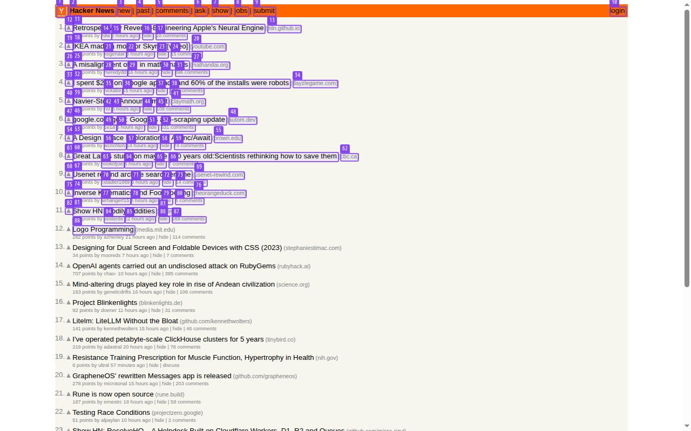
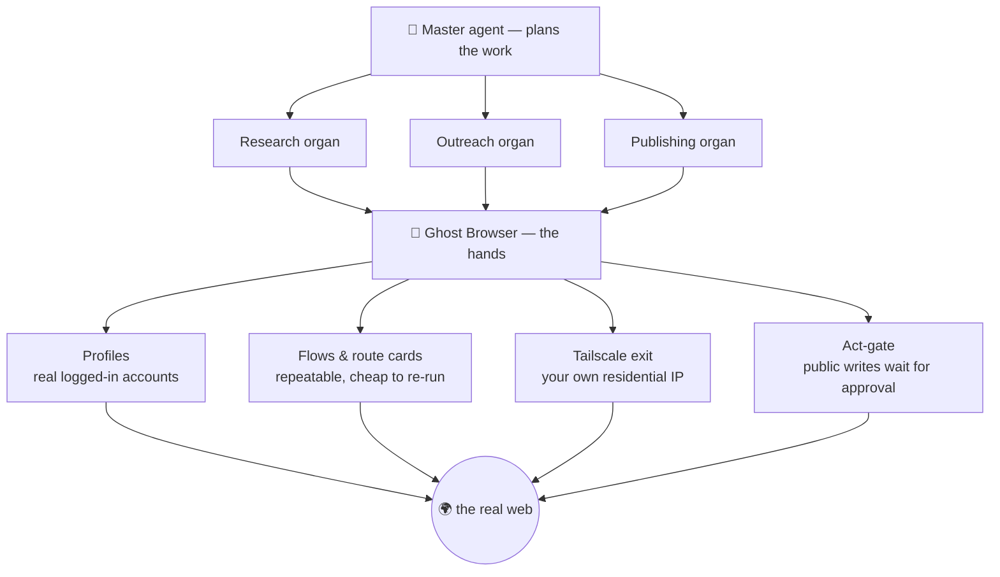

# Ghost Browser

**Give an AI agent real hands on the web.** A logged-in Chromium it drives like a person — seeing the page as numbered boxes, acting by number — behind a simple HTTP API, with an approval gate before anything public happens.

[](https://github.com/Wvdstoep/ghost-browser/actions/workflows/ci.yml)
[](LICENSE)
[](CONTRIBUTING.md)
[](https://github.com/sponsors/Wvdstoep)



> *What the agent actually sees — every interactive element on the live page numbered. It doesn't guess CSS selectors; it says "click 12".*

> ⚠️ **Early and honest:** the engine is solid and battle-tested in production, but the **console UI/UX is rough** — it was built by an engineer, not a designer. If design is your thing, this is a project where your help lands immediately and visibly. See [Help wanted](#help-wanted--especially-design--ux).

---

## Why this exists

An LLM can *decide* to reply to a lead, check a mailbox, or post an update. It cannot *do* it — it has no hands. Screen-scrapers and selector scripts break the moment a site is redesigned, and they can't hold a real logged-in session.

Ghost Browser is the missing hands. You log into a site **once, by hand**, and from then on an agent operates that real, logged-in session — robustly, because it perceives the page the way a person does, and safely, because anything the outside world would notice waits for your approval.

---

## What you can actually do with it

- **Log in once, automate forever.** Sign into LinkedIn / Gmail / a marketplace by hand in the console; the session persists in a **profile**, and the agent uses it from then on. No re-typing passwords, no storing credentials in scripts.
- **Let an agent operate the site by sight.** It gets a screenshot with every element numbered (Set-of-Mark) and acts by number — resilient to redesigns that shatter selector-based bots.
- **Keep a human in the loop where it matters.** Reading is free; posting, messaging, following, joining go through an **act-gate** that shows you the exact text and waits. Approve, edit, or reject.
- **Run repeatable jobs without an LLM in the loop.** Compose **workflows** — typed steps (fetch, extract, script, branch, verify, check-login…) that run deterministically and return data.
- **Teach it a site's API by watching it.** **Route cards** record a platform's own network traffic once, distil it, and replay it — so the second run is fast and costs no model calls.
- **Run many accounts, each isolated.** One **profile** per account, isolated cookies and storage, each labelled with the site it's signed into.
- **Leave through your own home connection.** A built-in **Tailscale exit** routes a profile's traffic out through a device you own, so sites see a residential address instead of a datacentre. ([setup →](SETUP.md#4-the-part-that-makes-it-different-leave-through-your-home-connection))

---

## What it powers: an autonomous operator

Ghost Browser isn't a demo — it's the tool that makes a fully autonomous setup possible.

On the platform it was built for, a **master agent** plans work and delegates to specialised **organs** (research, outreach, publishing, and more). Every time one of them needs to *touch the real web as a real account* — read the company mailbox, post an update, apply somewhere, check a reply — it calls **Ghost Browser**. Without it, the whole thing is a planner with no way to act: an LLM that knows what to do and physically can't.



The same three things that make that safe for an autonomous agent make it useful for *anything* you point it at: it sees like a person, it holds real sessions, and it never does something public behind your back.

---

## Quick start

```bash
git clone https://github.com/Wvdstoep/ghost-browser.git
cd ghost-browser
docker build -t ghost-browser .
docker run -d -p 3000:3000 -e API_KEYS="a-long-secret:team" -v ghost-profiles:/profiles ghost-browser
```

Open `http://localhost:3000` for the console. Full guide, including the home-IP exit: **[SETUP.md](SETUP.md)**.

### Drive it by API

```bash
KEY="a-long-secret"
# open a session
SID=$(curl -s -X POST localhost:3000/v1/sessions -H "Authorization: Bearer $KEY" | jq -r .sessionId)
# go somewhere
curl -s -X POST localhost:3000/v1/sessions/$SID/navigate -H "Authorization: Bearer $KEY" \
  -H 'content-type: application/json' -d '{"url":"https://news.ycombinator.com"}'
# see the page as numbered elements (+ a screenshot)
curl -s localhost:3000/v1/sessions/$SID/analyze -H "Authorization: Bearer $KEY"
# click element 3
curl -s -X POST localhost:3000/v1/sessions/$SID/click -H "Authorization: Bearer $KEY" \
  -H 'content-type: application/json' -d '{"index":3}'
```

### Or give the agent a goal

Point it at a model (Ollama Cloud key, or a self-hosted endpoint), give it a goal, and watch it work through the same numbered view a person sees. When it wants to post or message, it stops and shows you the draft first.

---

## How it sees: Set-of-Mark

Before any decision, every interactive element on screen gets a numbered box painted over it *in the live DOM*, the page is screenshotted, the boxes are stripped off again, and the agent gets the annotated picture plus a numbered list. It then says `click 3`.

That's why it survives redesigns where selectors don't: a numbered screenshot is redrawn from whatever is on screen right now, and a language model is far better at looking at a picture than at parsing a DOM tree. (`src/inspector.js` is the marking code.)

---

## Under the hood

<details>
<summary><b>Sessions, limits, and why one browser per container</b></summary>

A browser session is not a request — it's a live process holding memory for its whole life. One Chromium per container with a **context** per session (isolated cookies/storage, shared process) is the difference between ~2 sessions per box and ~10.

| Limit | Default | Env |
|---|---|---|
| Sessions per container | 8 | `MAX_CONTEXTS` |
| Idle before close | 5 min | `IDLE_MS` |
| Absolute session TTL | 2 h | `SESSION_TTL_MS` |
| Drain at memory | 80% | `MEMORY_LIMIT_PCT` |

Memory is read from the **cgroup**, not the host, so a 4 GB container on a 64 GB node knows its real ceiling. At the limit it stops accepting sessions, finishes what it has, and exits to be replaced — on our terms, not the OOM killer's.
</details>

<details>
<summary><b>The SSRF guard</b></summary>

`src/guard.js` is the most important file here. A browser anyone can point at any URL is a server-side request forgery engine, and it may run *inside* the cluster it would attack. It closes two bypasses: a public hostname that **resolves** to a private address (every resolved address is checked), and a public URL that **redirects** to one (the landing URL is re-checked and the page blanked if it moved somewhere it shouldn't).
</details>

<details>
<summary><b>Looking like a person, not a bot</b></summary>

Deliberate pacing (1–3 s between reads, 7–16 s after a write — real people don't open eleven posts in four seconds). A profile can present as Windows or macOS via CDP's `Emulation.setUserAgentOverride` (which sets `navigator.userAgent`, `userAgentData` and the `Sec-CH-UA-Platform` header together, so the browser never contradicts itself). It does **not** claim to be undetectable — canvas, fonts, WebGL and TLS still describe what it is; it removes specific, avoidable tells.
</details>

<details>
<summary><b>Full API surface</b></summary>

```
POST   /v1/sessions                      → { sessionId, expiresAt, plan }
POST   /v1/sessions/:id/navigate         { url }
GET    /v1/sessions/:id/analyze          → { elements, summary, screenshot }
POST   /v1/sessions/:id/click            { index } | { text }
POST   /v1/sessions/:id/type             { index, text, submit }
GET    /v1/sessions/:id/content          → cleaned page text
GET    /v1/sessions/:id/screenshot       → image/jpeg
DELETE /v1/sessions/:id
GET    /v1/workflows                     → saved flows, enriched with outcomes
POST   /v1/workflows                     { name, nodes, edges }
POST   /v1/workflows/:id/run             → run a flow
GET    /v1/capacity                      → what this worker can still take
GET    /v1/config                        → what is configured, never a secret
```
Auth is `Authorization: Bearer <key>`; keys come from `API_KEYS` (`key:plan,key:plan`). No key, no browser — a session costs real memory, so an anonymous one spends someone else's money.
</details>

---

## Help wanted — especially design & UX

The engine is solid; the **interface is not**, and that's exactly where contributions land hardest right now:

- 🎨 **Redesign the console** — layout, spacing, typography, the session and agent panels. Screenshots welcome. ([issue](https://github.com/Wvdstoep/ghost-browser/issues/2))
- 📱 **Make it responsive** — it's desktop-only today. ([issue](https://github.com/Wvdstoep/ghost-browser/issues/3))
- 🐛 **Fix the live view going black** on static pages. ([issue](https://github.com/Wvdstoep/ghost-browser/issues/1))

New here? Start with the [`good first issue`](https://github.com/Wvdstoep/ghost-browser/labels/good%20first%20issue) and [`ui`](https://github.com/Wvdstoep/ghost-browser/labels/ui) labels, and read [CONTRIBUTING.md](CONTRIBUTING.md). Design ideas without code are welcome too — open an issue with a sketch.

---

## License

[MIT](LICENSE) — use it, fork it, sell what you build with it. If it's useful to you, [a sponsorship](https://github.com/sponsors/Wvdstoep) keeps it moving.
